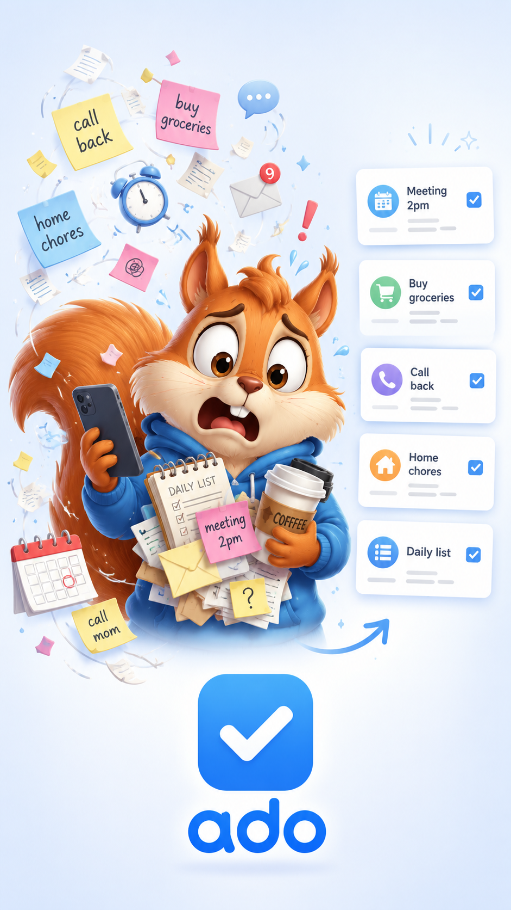

# ado

`ado` is a client/server task-list application for daily and longer-term task tracking.



## Layout

```text
server/             Go REST API, PostgreSQL migrations, scripts, tests
clients/android/    Kotlin/Jetpack Compose Android client
clients/web-local/  Plain static HTML/CSS/JS local browser client
```

## Server

The server is the canonical API and persistence layer. It provides:

- Project, task, and subtask CRUD
- Core `Daily` and `Home` projects
- Editable templates for daily and home chore defaults
- Daily, seasonal, and Home checklist task generation
- PostgreSQL migrations and seed data
- API and PostgreSQL integration tests
- Development CORS support for local clients

Quick start:

```sh
cd server
make db-init
make run-server
```

Default server port:

```text
8989
```

Server setup, database scripts, tests, and API examples are in [server/README.md](server/README.md).

## Public Configuration

This repository does not embed a private LAN server address. Configure the client that you use:

- `clients/web-local/` defaults to `http://localhost:8989`; change its API server URL in the browser settings panel and it is stored in `localStorage`.
- `clients/android/` defaults to `http://10.0.2.2:8989`, the Android emulator route to a server running on the development machine.
- For an Android build intended for a physical device, supply a reachable API URL at build time:

```sh
cd clients/android
ADO_SERVER_URL=http://api-host.example:8989 make install
```

The Android Settings screen can also change the URL after installation. If the app already has a URL saved in DataStore, that saved value overrides the build default until it is edited or app data is cleared.

If `web-local` is served from a LAN hostname/origin rather than opened directly or served from `localhost`, allow that origin when starting the server:

```sh
cd server
ADO_CORS_ORIGINS=http://web-host.example:5173 make run-server
```

Seeded templates are generic starter content in the public repository and can be edited through either client or the API after database initialization.

The `ado` / `ado` PostgreSQL credential in local development configuration is deliberately a disposable development default. Replace it and provide a corresponding `DATABASE_URL` for any non-local deployment.

## Clients

Both clients let you change the server URL locally; see Public Configuration above for their non-private defaults.

### Android

Path:

```text
clients/android/
```

The Android client is built with Kotlin and Jetpack Compose. It includes:

- Project, task, and subtask browsing
- Create/edit/delete for projects, tasks, and subtasks
- Bulk-create tasks and subtasks from pasted text
- Task/subtask done/todo toggles
- Room-backed local cache
- Offline mutation queue for create/edit/delete/toggle
- Offline queued Daily/Home generation with placeholders
- Template list and template edit screens
- Settings and sync queue screens

Build:

```sh
cd clients/android
make build
```

Install on a connected device:

```sh
make install
```

More detail is in [clients/android/README.md](clients/android/README.md).

### web-local

Path:

```text
clients/web-local/
```

`web-local` is a no-build static browser client. It uses plain HTML, CSS, JavaScript, `fetch`, and `localStorage`; there is no npm, bundler, framework, or local backend shim.

It includes:

- Project, task, and subtask browsing
- Project creation
- Task and subtask creation
- Bulk-create tasks and subtasks from pasted text
- Task/subtask done/todo toggles
- Daily, Home seasonal, and Leaving house checklist generation buttons
- `localStorage` cache for recently fetched data
- Read-only cached display when the server is unavailable

Open directly:

```text
clients/web-local/index.html
```

Or serve locally:

```sh
cd clients/web-local
python3 -m http.server 5173
```

Then open:

```text
http://localhost:5173
```

More detail is in [clients/web-local/README.md](clients/web-local/README.md).

## Client Capability Notes

Android is the fuller offline-capable client. `web-local` is intentionally simpler and currently has no offline write queue; creates and toggles require the server, while cached data can still be viewed if the server is unavailable.
